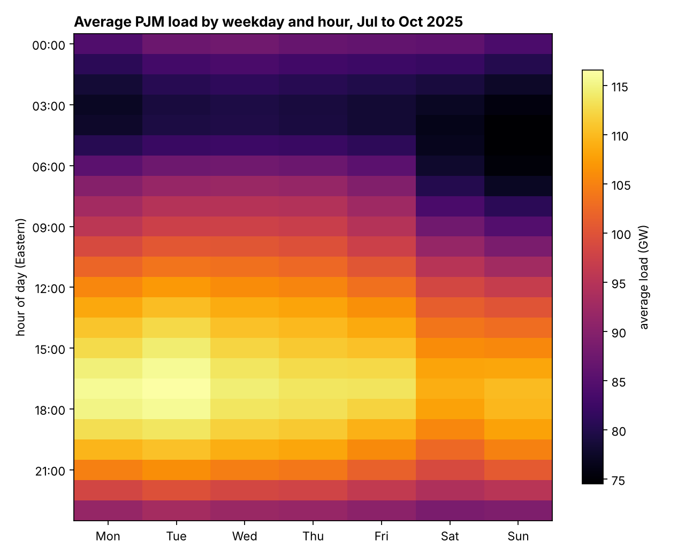
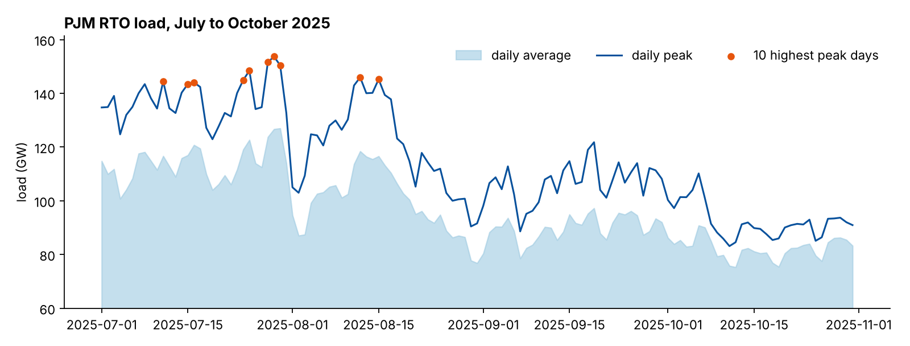

# How Accurate Are PJM Load Forecasts?

**Forecast accuracy analysis of PJM electricity demand for AEP Energy**

Denison University Data Analytics Practicum (DA 301), Fall 2025 · Client project with AEP Energy



PJM Interconnection runs the grid for 13 states and Washington, D.C., and publishes load forecasts from a few hours to seven days ahead. AEP Energy uses those forecasts to plan operations and to warn customers about peak demand. Our team measured how accurate the forecasts really are: how error changes with forecast horizon, when during the week errors are largest, and how much weather explains demand.

## Key findings

1. **The 42 to 48 hour window is the sweet spot.** Among the horizons we compared, forecasts issued 42 to 48 hours ahead had the lowest error and the tightest error distribution.
2. **Forecasts are systematically biased.** At the 0 hour horizon, PJM forecasts overpredicted actual demand by about 930 MW on average.
3. **Error peaks with demand.** The highest load and the largest forecast errors fall between 5 and 7 PM on weekdays, especially Wednesday.
4. **Temperature drives demand.** Temperature was by far the strongest weather predictor of daily usage. Wind, precipitation and snowfall were weak.
5. **Peaks are a weekday problem.** All ten highest demand days in the study period fell on weekdays.

Full methods and results are in the final report delivered to AEP Energy.

## Recommendations to AEP Energy

* Use the 42 to 48 hour forecast window for operational decisions, customer notifications and peak alerts.
* Treat temperature as the primary weather input and wind, precipitation and snowfall as secondary.
* Concentrate planning and reserve allocation on weekday late afternoons and early evenings.
* Explore sequence models such as LSTMs and GRUs to cut the remaining 1.45% median error on peak days.

## A look at the data

The repository includes PJM metered load for July through October 2025, which is enough to reproduce the load patterns behind findings 3 and 5:

```bash
pip install pandas matplotlib
python python/load_patterns.py
```

```
2,952 hourly RTO observations, 2025-07-01 to 2025-10-31
Highest average load: Tuesday at 17:00 (116.6 GW)
Top 10 peak days: all weekdays, all in July and August
```



## Methods

* **Data.** Hourly actual load and forecasts from PJM Data Miner (July 2024 to October 2025, RTO zone covering the whole PJM footprint), plus daily NOAA weather from stations across the PJM territory. See [`data/README.md`](data/README.md).
* **Alignment.** Forecasts were matched to actual load by timestamp, and each forecast's horizon was computed as the time between when it was issued and the hour it predicts.
* **Error metrics.** Error = actual minus forecast, plus absolute error, MAPE and median absolute percentage error (MdAPE), summarized by horizon, hour of day and day of week.
* **Statistics.** Paired t-tests of actual vs. forecast load for each horizon window, a chi-square test on load categorized as low, medium and high, and correlations between weather variables and daily load.

## Repository layout

```
├── R/
│   ├── 01_daily_actual_vs_forecast_2024.R      daily totals and top load days
│   └── 02_forecast_bias_tests_and_heatmaps.R    t-tests, bias by hour, heatmaps
├── python/
│   └── load_patterns.py                         figures in this README
├── data/
│   ├── hour_load_metered.csv                    PJM metered load, Jul to Oct 2025
│   └── README.md                                sources for the other datasets
└── assets/                                      figures
```

The R scripts expect the larger PJM forecast and 2024 load files in `data/`; `data/README.md` lists where to download them.

## Team

| Member | Focus |
|---|---|
| Hamdan Ashfaq | Forecast accuracy analysis, error visualization, documentation |
| Daniel Ha | Statistical testing, paired t-tests, bias analysis |
| Natalie Fieberg | Weather and external factor analysis |
| Luke Olmstead | Power BI dashboard, forecast accuracy evaluation |

Course instructor: Dr. Sarah Supp. Client liaisons: Josh Brown and Fredrik Bergstrand, AEP Energy.

## Data and license

All PJM and NOAA data used here are publicly available. Code is released under the [MIT License](LICENSE).
